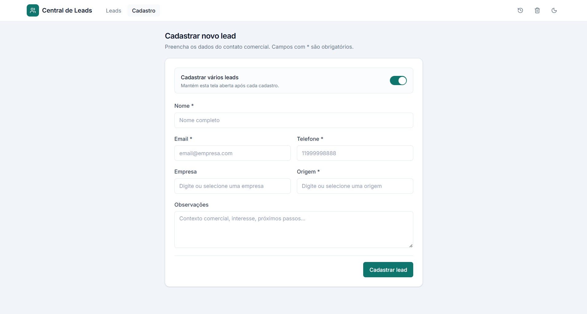
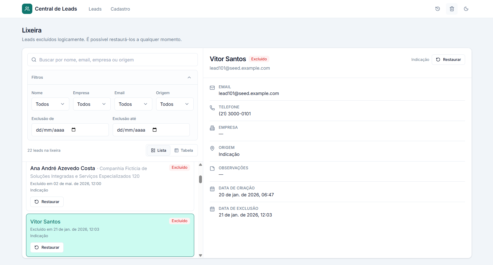
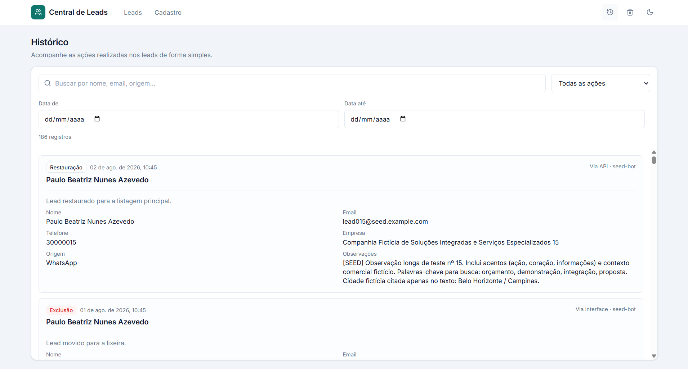
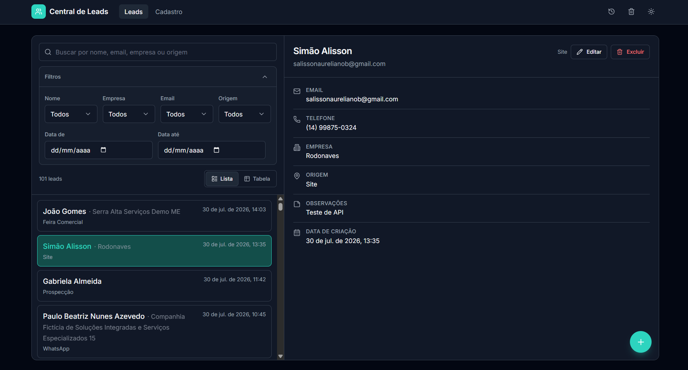

# Central de Leads

Sistema de gerenciamento de leads comerciais com API REST (Node.js + Express + Supabase) e interface CRM (React + Vite).

Permite cadastrar, listar, buscar, editar, excluir logicamente (lixeira), restaurar e auditar leads em um fluxo simples e organizado.

---

## Demonstração

### Tela inicial

Lista de leads com busca, filtros e alternância lista/tabela.


### Tela inicial — detalhes do lead

Painel lateral com os dados completos do lead selecionado.


### Visão em tabela

Alternância para visualização tabular, com ordenação por colunas.


### Detalhes na visão em tabela

Modal de detalhes ao selecionar um lead na tabela.


### Cadastro de lead

Formulário com validação, sugestões de empresa/origem e opção de cadastrar vários leads.



### Lixeira

Leads excluídos logicamente, com busca, filtros e restauração.



### Histórico

Auditoria de criação, edição, exclusão e restauração.



### Tema escuro

A interface respeita o tema do sistema e permite alternância manual.



---

## Funcionalidades

- Cadastro de leads com validação (frontend e backend)
- Listagem ordenada do mais recente para o mais antigo
- Busca no banco por nome, email, telefone, CPF/CNPJ, empresa, origem e palavras da observação
- Normalização de telefone e CPF/CNPJ (entrada com ou sem máscara; persiste apenas dígitos)
- Campo opcional CPF/CNPJ: valida/salva/busca após normalizar; exibe com máscara (`000.000.000-00` / `00.000.000/0000-00`)
- Filtros multi-seleção (nome, empresa, email, origem) com busca interna
- Filtro por intervalo de datas
- Visualização em lista (estilo CRM) e em tabela (com coluna de telefone)
- Painel/modal de detalhes
- Edição completa reutilizando o mesmo formulário
- Soft delete (lixeira) e restauração
- Histórico/auditoria (criação, edição, exclusão, restauração)
- Tema claro e escuro
- Confirmação de exclusão via modal da UI (sem `window.confirm`)
- Confirmação ao pressionar Enter no campo de observações antes de salvar
- Toggle “Cadastrar vários leads” na tela de cadastro
- Layout responsivo pensado para celulares (a partir de ~320px)
- Massa de dados fictícios para testes (`npm run seed`)

---

## Tecnologias utilizadas

### Frontend

- React 19
- Vite
- React Router
- Axios
- Tailwind CSS 4
- Lucide React
- Radix UI (Label, Slot)
- class-variance-authority / clsx / tailwind-merge

### Backend

- Node.js
- Express 5
- CORS
- dotenv
- @supabase/supabase-js

### Banco

- PostgreSQL (via Supabase)
- Row Level Security (habilitado; políticas permissivas no escopo do desafio)

### Ferramentas

- Nodemon (dev do backend)
- ESLint (frontend)

---

## Arquitetura

```
Usuário → React (Vite) → Proxy /api → Express API → Supabase Client → PostgreSQL
```

| Camada | Responsabilidade |
|--------|------------------|
| **Frontend** | UI, validação de formulário, estados (loading/erro/sucesso), filtros locais |
| **API (Express)** | Rotas, validação de entrada, status HTTP, orquestração |
| **Services** | Comunicação com Supabase, regras de soft delete e histórico |
| **Supabase/Postgres** | Persistência, índices, constraints, RLS |

Separação no backend: **routes** → **controllers** → **services** → **Supabase**.

---

## Estrutura do projeto

```
DesafioTecnicoSimaoAlisson/
├── README.md
├── prompts.md
├── .gitignore
├── backend/
│   ├── .env                 # local (não versionado)
│   ├── .env.example         # versionado (modelo)
│   ├── package.json
│   ├── schema.sql
│   ├── scripts/seed.js
│   └── src/
│       ├── server.js
│       ├── config/supabase.js
│       ├── routes/
│       ├── controllers/
│       ├── services/
│       ├── middlewares/errorHandler.js
│       └── utils/validators.js | brazilDocs.js | supabaseError.js
└── frontend/
    ├── package.json
    ├── vite.config.js
    └── src/
        ├── App.jsx
        ├── pages/
        ├── components/
        ├── services/api.js
        ├── lib/utils.js
        └── hooks/useTheme.jsx
```

Há também `backend/migrations/` para alterações aditivas em bancos já existentes (ex.: coluna `cpf_cnpj`).
---

## Como executar

### 1. Backend

```bash
cd backend
npm install
```

Copie o exemplo de variáveis e preencha com as credenciais do seu projeto Supabase:

```bash
cp .env.example .env
```

No Windows (PowerShell):

```powershell
Copy-Item .env.example .env
```

Edite `backend/.env` com `SUPABASE_URL`, `SUPABASE_KEY` e, se quiser, `CORS_ORIGIN` / `PORT`.

Execute o SQL em [`backend/schema.sql`](backend/schema.sql) no SQL Editor do Supabase (cria a tabela `leads` e estruturas auxiliares).

Se o banco **já existir** sem a coluna `cpf_cnpj`, execute também [`backend/migrations/001_add_cpf_cnpj.sql`](backend/migrations/001_add_cpf_cnpj.sql) (ou rode novamente o `schema.sql`, que é aditivo com `ADD COLUMN IF NOT EXISTS`).

```bash
npm run dev
# ou: npm start
```

API em `http://localhost:3000`.

### 2. Frontend

```bash
cd frontend
npm install
npm run dev
```

Interface em `http://localhost:5173` (proxy `/api` → `http://localhost:3000`).

### 3. Dados de teste (opcional)

```bash
cd backend
npm run seed
# limpar apenas o seed:
npm run seed:cleanup
```

Cria **120 leads fictícios** (`@seed.example.com`) + histórico. Idempotente.

---

## Variáveis de ambiente

Use [`backend/.env.example`](backend/.env.example) como modelo. O arquivo real `backend/.env` é ignorado pelo Git.

```env
SUPABASE_URL=
SUPABASE_KEY=
PORT=3000
CORS_ORIGIN=http://localhost:5173
```

| Variável | Descrição |
|----------|-----------|
| `SUPABASE_URL` | URL do projeto Supabase |
| `SUPABASE_KEY` | Chave usada pelo backend (preferir service role só no servidor) |
| `PORT` | Porta da API (padrão 3000) |
| `CORS_ORIGIN` | Origens permitidas (vírgula para várias) |
| `NODE_ENV` | Se `production`, respostas 503 não expõem detalhes de setup |

Nunca versione valores reais de credenciais.

---

## API

Headers opcionais de auditoria: `X-Action-Origin`, `X-User` (metadado; **não** são autenticação).

### `GET /health`

Health check. **200** `{ status: "ok" }`

### `GET /api/leads`

Lista leads ativos (`deleted_at` null). Query: `search`.

**200** `{ total, data }`

### `GET /api/leads/trash`

Lista leads na lixeira. Query: `search`.

### `GET /api/leads/:id`

Busca lead ativo por UUID. **200** / **400** (UUID inválido) / **404**

### `POST /api/leads`

Cadastra lead.

Body:

```json
{
  "nome": "string",
  "email": "string",
  "telefone": "string",
  "empresa": "string|null",
  "origem": "string",
  "observacoes": "string|null",
  "cpf_cnpj": "string|null"
}
```

`telefone` e `cpf_cnpj` aceitam entrada **com ou sem máscara**. A API remove caracteres não numéricos (`.`, `-`, `/`, `_`, espaços etc.), valida e persiste **apenas dígitos**. Na UI, o valor é exibido de novo com a máscara adequada. `cpf_cnpj` é **opcional** (CPF com 11 ou CNPJ com 14 dígitos, com validação de dígitos verificadores).

**201** criado · **400** validação · **500/503** erro

### `PUT /api/leads/:id`

Atualiza lead ativo. Mesmo body. **200** / **400** / **404**

### `DELETE /api/leads/:id`

Soft delete (`deleted_at = now()`). **200** / **400** / **404**

### `POST /api/leads/:id/restore`

Restaura da lixeira. **200** / **400** (não está na lixeira) / **404**

### `GET /api/history`

Lista auditoria. Query: `leadId`, `action` (`criacao|edicao|exclusao|restauracao`), `search`.

**200** `{ total, data }`

---

## Banco de dados

### `leads`

| Campo | Tipo | Notas |
|-------|------|-------|
| id | uuid PK | `gen_random_uuid()` |
| nome, email, telefone, origem | text | obrigatórios na API |
| empresa, observacoes, cpf_cnpj | text | opcionais (`cpf_cnpj` só dígitos) |
| created_at | timestamptz | default `now()` |
| deleted_at | timestamptz | soft delete |

### `lead_history`

| Campo | Tipo | Notas |
|-------|------|-------|
| id | uuid PK | |
| lead_id | uuid FK → leads | `ON DELETE SET NULL` |
| action | text | CHECK: criacao, edicao, exclusao, restauracao |
| old_values / new_values | jsonb | snapshots |
| usuario, origem | text | metadados |
| created_at | timestamptz | |

### Índices / constraints

- `idx_leads_deleted_at`, `idx_leads_created_at`, `idx_leads_nome`, `idx_leads_origem`
- **Unique parcial** `idx_leads_email_ativos` em `lower(email)` onde `deleted_at IS NULL`
- Índices em `lead_history(lead_id)` e `created_at`

Se existirem e-mails duplicados entre leads **ativos**, resolva antes de criar o índice único parcial.

Script: [`backend/schema.sql`](backend/schema.sql) (idempotente na medida do possível).

Migration aditiva para bancos antigos: [`backend/migrations/001_add_cpf_cnpj.sql`](backend/migrations/001_add_cpf_cnpj.sql).

---

## Melhorias adicionais

### Layout e responsividade mobile

A interface foi revisada para telas a partir de ~320px: tipografia e paddings menores no header, filtros e tabela; colunas secundárias da tabela ocultas em breakpoints menores (telefone permanece visível); dropdowns de filtro respeitam a largura da viewport; formulário e detalhes evitam overflow horizontal sem mudar a identidade visual.

### Telefone na tabela e na busca

A visão em tabela inclui a coluna **Telefone**, formatada no padrão `(DD) 99999-9999` / `(DD) 9999-9999`. A busca da API passa a considerar `telefone` (e a variante só com dígitos), então termos como `14999999999`, `(14) 99999-9999` ou `99999-9999` encontram o mesmo lead.

### Normalização e formatação de telefone

A lógica fica centralizada em `backend/src/utils/brazilDocs.js` e espelhada em `frontend/src/lib/utils.js`: remove máscaras, trata DDI `+55` quando aplicável, valida 8–11 dígitos e formata na exibição/input. No banco continua armazenado apenas com dígitos (sem perda de informação do número).

### Campo opcional CPF/CNPJ

O campo **CPF/CNPJ** continua opcional. A entrada aceita o documento **com ou sem máscara**; o sistema **normaliza para apenas dígitos** antes de validar, salvar e pesquisar (lógica centralizada em `brazilDocs.js` / `lib/utils.js`).

Exemplos de CNPJ tratados da mesma forma (formatação; o documento precisa ser válido nos dígitos verificadores para cadastro):

| Entrada | Normalizado (banco) | Exibição |
|---------|---------------------|----------|
| `12.345.678/0001-95` | `12345678000195` | `12.345.678/0001-95` |
| `12 345 678/0001-95` | idem | idem |
| `12-345-678/0001-95` | idem | idem |
| `12_345_678/0001-95` | idem | idem |
| `12345678000195` | idem | idem |

O mesmo vale para CPF (ex.: `529.982.247-25` ↔ `52998224725` ↔ `529.982.247-25`).

- Caracteres de formatação (`.`, `-`, `/`, `_`, espaços etc.) são removidos na normalização e **não geram erro** por si só.
- Validação usa só os dígitos (11 = CPF, 14 = CNPJ, com dígitos verificadores).
- Persistência no banco: apenas dígitos (`null` se vazio).
- Exibição: máscara `000.000.000-00` (CPF) ou `00.000.000/0000-00` (CNPJ).
- Busca: funciona com ou sem formatação (variante numérica no backend).
- Frontend: cadastro, edição, detalhes e histórico.
- Seed: mistura de leads com CPF, com CNPJ e sem documento.
- Schema/migration aditiva: não altera documentos já existentes de forma destrutiva.

### Confirmação ao salvar com Enter nas observações

No campo de observações, **Enter** abre o `ConfirmDialog` existente (“Salvar” / “Cancelar”) em vez de gravar imediatamente. **Shift+Enter** continua inserindo nova linha. Cancelar fecha só o diálogo e mantém o formulário intacto; Salvar valida e persiste com o feedback habitual. O botão de submit do formulário segue salvando diretamente.

---

## Segurança

Implementado neste desafio:

- CORS via `CORS_ORIGIN` (sem `*` por padrão)
- Limite de JSON `32kb`
- Validação centralizada (`validators.js` + `brazilDocs.js`): UUID, obrigatórios, tamanhos, telefone, CPF/CNPJ, ações
- Sanitização e tokenização da busca (máx. 50 chars; remove `, . ( ) % / _ -` e similares de formatação)
- Erros mapeados (`supabaseError.js`); 503/500 genéricos em produção
- Histórico resiliente (`safeRecordHistory`): falha de auditoria não desfaz o CRUD
- `.env` fora do Git
- Soft delete + unique parcial de email ativos

---

## Limitações conhecidas

| Limitação | Impacto |
|-----------|---------|
| Sem autenticação de usuários | Qualquer cliente que alcance a API pode operar |
| RLS com `using (true)` | Políticas permissivas; falsa segurança se a anon key vazar |
| Headers `X-User` / `X-Action-Origin` | Spoofáveis; apenas metadado de auditoria |
| Sem rate limiting | Exposto a abuso de volume |
| Sem paginação na API | Listagens retornam o conjunto completo |
| Filtro `search` do histórico | Parte do filtro é feita em memória após o fetch |

### Recomendações para produção

- Autenticação (JWT / sessão) e autorização por papel
- Service role **somente** no backend; RLS restritivo para anon
- API key / gateway na frente da API
- Rate limiting em rotas de escrita
- Paginação (`limit`/`offset` ou cursor)
- Observabilidade (request-id, métricas)

---

## Decisões técnicas

- **Camadas routes → controllers → services:** controllers validam e respondem HTTP; services falam com o banco.
- **Histórico não-atômico com o CRUD:** a operação principal (criar/editar/excluir) tem prioridade; auditoria falha em log sem reverter o lead.
- **Validação no backend mesmo com frontend:** defesa em profundidade; o cliente não é confiável.
- **Documentos e telefone normalizados:** persistir dígitos evita divergência na busca e na comparação; a formatação fica na camada de apresentação.
- **Soft delete:** preserva dados e alimenta lixeira/auditoria.
- **Auth/RLS restritivo fora do escopo mínimo do desafio Integrale:** documentados como limitações conscientes.
- **Proxy Vite `/api`:** evita CORS no browser em desenvolvimento; a API ainda restringe `CORS_ORIGIN` para chamadas diretas.

---

## Dificuldades encontradas

- **Schema evolutivo no Supabase:** a tabela começou mínima e ganhou `deleted_at`, histórico e depois `cpf_cnpj`; foi preciso um `schema.sql` idempotente (`IF NOT EXISTS` / `ADD COLUMN IF NOT EXISTS`) e migrations aditivas para quem já tinha a base criada.
- **Busca de telefone/CPF com máscara:** o PostgREST compara texto; como o banco guarda só dígitos, a busca também gera uma variante numérica do token para `telefone` e `cpf_cnpj`.
- **Filtro de busca no PostgREST:** combinar busca textual em vários campos com filtros de origem/empresa exige cuidado com a sintaxe `.or()` do client Supabase e sanitização do termo.
- **CORS vs proxy Vite:** em desenvolvimento o front usa proxy `/api`; a API ainda valida `CORS_ORIGIN` para chamadas diretas — fácil confundir “erro de CORS” com backend parado ou `.env` incompleto.
- **Histórico resiliente:** registrar auditoria sem bloquear o CRUD principal; falha de histórico vira log, não rollback do lead.

---

## Desafio técnico

Repositório de referência: [processo-seletivo-analista-ti](https://github.com/Integrale-Gestao-Empresarial/processo-seletivo-analista-ti)

### Requisitos solicitados

| Requisito | Atendimento |
|-----------|-------------|
| Modelar leads no Supabase | Sim |
| API Node criar lead | `POST /api/leads` |
| API listar + filtro | `GET /api/leads?search=` |
| Validação e erros claros | Sim |
| Front cadastro + listagem | `/cadastro` e `/` |
| README + decisões + dificuldades | Este arquivo |
| `.env.example` (sem valores reais) | `backend/.env.example` |
| Script SQL `CREATE TABLE` | `backend/schema.sql` |
| Registro de prompts de IA | `prompts.md` |

### Melhorias extras

- Soft delete / lixeira / restauração
- Edição de leads
- Histórico completo de auditoria
- Tema claro/escuro
- Visão tabela + ordenação (incluindo telefone)
- Filtros multi-seleção e busca por múltiplos campos (telefone e CPF/CNPJ)
- Campo opcional CPF/CNPJ
- Normalização/formatação de telefone e documentos
- Confirmação ao pressionar Enter em observações
- Ajustes de layout mobile
- Hardening (CORS, validação, sanitização, erros, histórico resiliente)
- Seed de dados fictícios
- Ajustes de acessibilidade (modal, tabela, formulário)

---

## Uso de IA e prompts

O arquivo [`prompts.md`](prompts.md) registra os **principais prompts** utilizados no desenvolvimento com assistência de IA (Cursor).

Além dos principais prompts documentados no arquivo `prompts.md`, durante o desenvolvimento também foram realizadas pequenas melhorias e ajustes incrementais no projeto, incluindo ajustes de layout mobile, melhorias na busca e formatação de telefones, inclusão do campo CPF/CNPJ e refinamentos de experiência de usuário.

Isso não significa que todas as alterações do projeto tenham sido feitas exclusivamente por IA: o arquivo concentra os prompts centrais, enquanto refinamentos pontuais também ocorreram ao longo do ciclo de desenvolvimento.

---

## Possíveis melhorias futuras

- Autenticação e autorização
- RLS restritivo + service role apenas no servidor
- Paginação e rate limiting
- Testes automatizados (API e UI)
- Exportação CSV / dashboard de métricas
- Busca full-text no Postgres (`tsvector`)
- Atomicidade opcional via RPC/transação quando a auditoria for crítica

---

## Dados de teste

Massa fictícia em `backend/scripts/seed.js` (domínio `@seed.example.com`).

```bash
cd backend
npm run seed
npm run seed:cleanup
```

---

## Licença / entrega

Projeto desenvolvido como desafio técnico. Uso de IA documentado em `prompts.md`.
